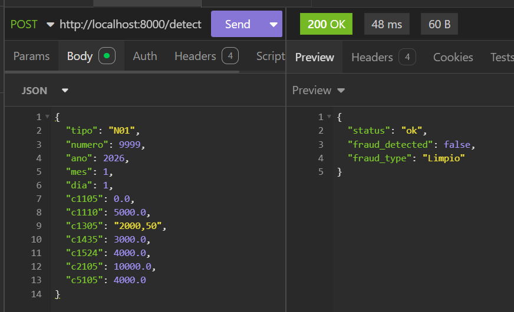
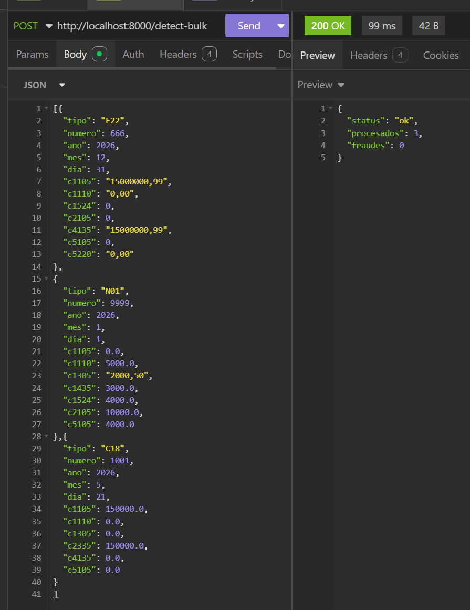
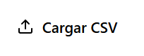
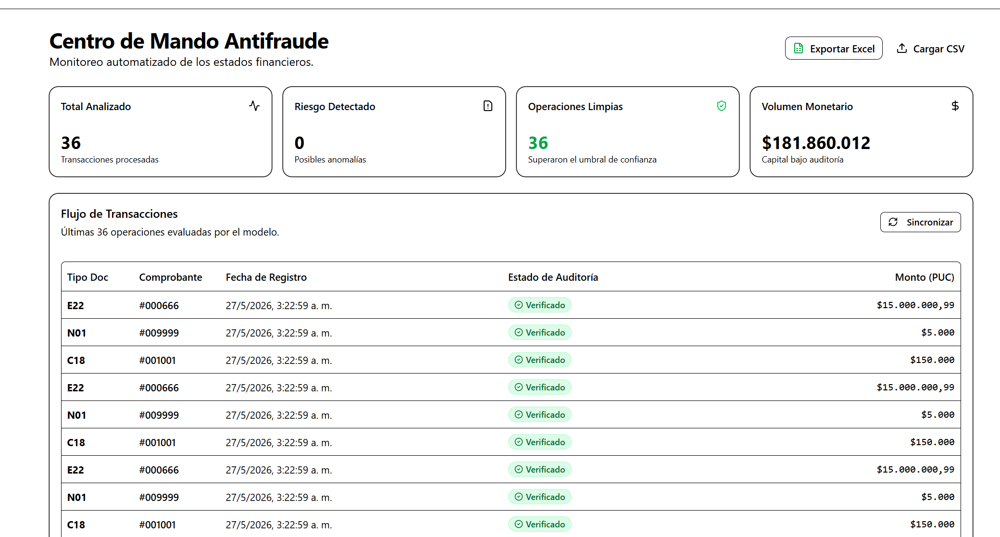
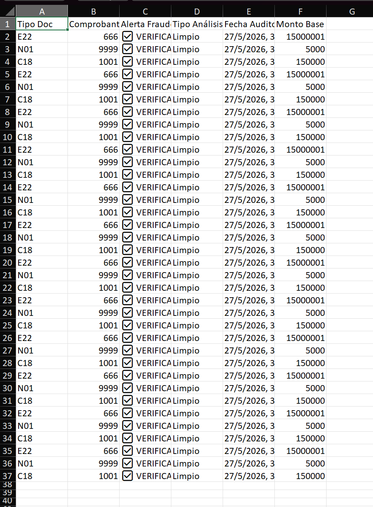

# Sistema de Prevención de Fraudes Financieros (Detector 3000)

## 1. Descripción General del Proyecto

Este sistema es una solución de auditoría contable y detección de anomalías financieras orientada al ecosistema empresarial colombiano. El software se integra de manera no invasiva con sistemas contables de terceros (ERP), capturando registros estructurados según el Plan Único de Cuentas (PUC) de Colombia.

A través de un motor local de Inteligencia Artificial fundamentado en modelos de Gradient Boosting (XGBoost), el sistema evalúa en tiempo real el riesgo de fraude de cada transacción, emitiendo un veredicto binario de alerta y una clasificación multiclase del tipo de anomalía detectada.

### 1.1 Arquitectura del Sistema

El aplicativo implementa una **arquitectura local desacoplada mediante el patrón Sidecar**, garantizando la soberanía absoluta de los datos financieros al ejecutar todo el procesamiento en el entorno local (`localhost`) del cliente, eliminando dependencias de red externa y vulnerabilidades en la nube.

* **Capa de Presentación (Frontend):** Construida sobre React, TypeScript y Tailwind CSS, utilizando componentes de alta fidelidad de Shadcn UI. La navegación interna está gobernada por `TanStack Router`, mientras que la sincronización asíncrona del flujo de datos contables se gestiona mediante `TanStack Query`.
* **Capa Core de Orquestación (Tauri):** Desarrollada en Rust, actúa como el anfitrión del sistema operativo. Gobierna el ciclo de vida del subproceso secundario y aplica interceptores nativos para asegurar el cierre coordinado de la infraestructura.
* **Capa de Inferencia (Backend Sidecar):** Una API REST de alta disponibilidad construida con FastAPI (Python 3.13). Carga en memoria RAM los estimadores matemáticos serializados y ejecuta un pipeline automático de *Feature Engineering* para expandir el payload crudo a las 177 características requeridas por los modelos.
* **Capa de Persistencia:** Base de datos embebida SQLite configurada en modo WAL (Write-Ahead Logging). Almacena de forma híbrida los metadatos indexables de la auditoría junto con el payload original en formato JSON.

---

## 2. Requisitos Previos del Sistema

Para compilar de extremo a extremo el proyecto, la estación de trabajo debe contar con los siguientes componentes globales:

* **Entorno Node.js:** Versión LTS activa (v20 o superior) y gestor de paquetes **`pnpm`**.
* **Entorno Python:** Versión 3.13.x con el gestor de entornos virtuales `venv`.
* **Entorno Rust:** Herramientas de compilación de Cargo y el compilador de Rust (`rustc`) instalados mediante `rustup`.
* **Herramientas de Windows:** Visual Studio Build Tools con soporte para C++ (requerido para los enlaces nativos de XGBoost).

---

## 3. Guía Paso a Paso para la Compilación del Proyecto

Siga estrictamente el orden secuencial descrito a continuación para asegurar el correcto acoplamiento de los componentes binarios.

### Paso 3.1: Configuración y Preparación del Entorno Backend

1. Ingrese al directorio del backend y cree un entorno virtual aislado:

```bash
cd backend
python -m venv venv

```

2. Active el entorno virtual (En Windows PowerShell):

```powershell
.\venv\Scripts\Activate.ps1

```

3. Instale las dependencias base de manipulación de datos, el framework de servicios y los motores de Machine Learning necesarios:

```bash
pip install pandas xgboost scikit-learn joblib fastapi uvicorn pyinstaller

```

4. Coloque los dos archivos de modelos serializados (`PRODUCCION_CAMPEON_binario.joblib` y `PRODUCCION_CAMPEON_multiclase.joblib`) directamente en la raíz de la carpeta `backend/`.

### Paso 3.2: Compilación Estática del Motor de IA en Python

Dado que XGBoost interactúa con librerías nativas dinámicas en C++, se debe ejecutar un empaquetado de recolección profunda utilizando PyInstaller.

Ejecute la compilación desde la raíz del entorno virtual del backend:

```powershell
pyinstaller --name motor_ia --onefile --noconsole --collect-all xgboost --copy-metadata xgboost --hidden-import="sklearn" --hidden-import="pandas" --hidden-import="joblib" --add-data "PRODUCCION_CAMPEON_binario.joblib;." --add-data "PRODUCCION_CAMPEON_multiclase.joblib;." main.py

```

* **Ubicación de Salida:** Tras finalizar el proceso, el binario independiente se generará en el directorio `backend/dist/motor_ia.exe`.

### Paso 3.3: Integración del Binario Sidecar en el Ecosistema Tauri

Tauri requiere un esquema de nomenclatura estricto basado en la arquitectura del sistema operativo para inyectar el subproceso secundario.

1. Navegue al directorio del frontend y asegúrese de que exista la ruta de destino:

```bash
cd ../frontend
mkdir -p src-tauri/binaries

```

2. Copie el archivo ejecutable hacia la carpeta interna de Tauri y renómbrelo de forma exacta motor_ia-x86_64-pc-windows-msvc.exe (ejemplo para Windows 64-bit), si la carpeta binaries no existe es necesario crearla:

```powershell
copy ..\backend\dist\motor_ia.exe .\src-tauri\binaries\motor_ia-x86_64-pc-windows-msvc.exe

```

3. Verifique que el archivo `src-tauri/tauri.conf.json` declare de manera explícita el Sidecar dentro de su bloque de empaquetado:

```json
{
  "tauri": {
    "bundle": {
      "active": true,
      "targets": "all",
      "externalBin": [
        "binaries/motor_ia"
      ]
    }
  }
}

```

### Paso 3.4: Compilación de la Aplicación de Escritorio de Tauri

1. Estando en el directorio del frontend, instale las dependencias necesarias utilizando **`pnpm`**:

```bash
pnpm install

```

2. Inicie el empaquetado definitivo de la aplicación de escritorio:

```bash
pnpm tauri build

```

* **Ubicación del Instalador:** El instalador empaquetado en formato Microsoft Installer (`.msi`) se almacenará en:
`frontend/src-tauri/target/release/bundle/msi/Detector_de_Fraudes_3000_x64_en-US.msi`

---

## 4. Ejemplos de Transacciones para Pruebas (API REST)

Una vez desplegada la aplicación, el software contable externo puede interactuar mediante peticiones **POST** dirigidas al endpoint expuesto en la dirección: `http://127.0.0.1:8000/detect`.

> Los datos de ejemplo para pruebas se encuentran en la carpeta `extras/`. Allí encontrará `extras/data.csv` y `extras/data.json` con registros de transacciones listos para usar.

---

### 4.1 Estructura del Payload

Cada transacción debe enviarse como un objeto JSON con los siguientes campos. Las cuentas del PUC no incluidas se asumen en `0` automáticamente.

| Campo | Tipo | Descripción |
|---|---|---|
| `numero` | `int` | Número del comprobante contable |
| `tipo` | `string` | Código del tipo de documento (ej: `"C18"`, `"E22"`) |
| `ano` | `int` | Año de la transacción |
| `mes` | `int` | Mes de la transacción (1–12) |
| `dia` | `int` | Día de la transacción (1–31) |
| `c1105`, `c1110`, ... | `number` | Cuentas del PUC con sus montos. Los valores decimales usan **coma** como separador (ej: `"25000000,50"`) |

Ejemplo de payload mínimo:

```json
{
  "numero": 1002,
  "tipo": "C18",
  "ano": 2026,
  "mes": 6,
  "dia": 15,
  "c1105": 50000,
  "c2335": 50000
}
```

Respuesta esperada del servidor:

```json
{
  "status": "ok",
  "fraud_detected": false,
  "fraud_type": "Limpio"
}
```

---

### 4.2 Opción A: Prueba mediante Postman o Insomnia

Esta es la forma más directa para probar el endpoint de forma individual.

**Paso 1:** Asegúrese de que la aplicación esté corriendo. El backend estará disponible en `http://127.0.0.1:8000`.

**Paso 2:** Cree una nueva petición con la siguiente configuración:

* Método: `POST`
* URL: `http://127.0.0.1:8000/detect`
* Header: `Content-Type: application/json`

**Paso 3:** En el cuerpo de la petición (Body → raw → JSON), pegue uno de los registros del archivo `extras/data.json`:

```json
{
  "numero": 1002,
  "tipo": "C18",
  "ano": 2026,
  "mes": 6,
  "dia": 15,
  "c1105": 50000,
  "c2335": 50000
}
```

**Paso 4:** Envíe la petición y verifique la respuesta en el panel inferior.



Para probar el endpoint de **procesamiento masivo**, cambie la URL a `http://127.0.0.1:8000/detect-bulk` y envíe un array JSON con múltiples transacciones (puede usar el contenido completo de `extras/data.json` directamente).



---

### 4.3 Opción B: Carga masiva desde la interfaz gráfica (archivo CSV)

La aplicación permite cargar un archivo `.csv` directamente desde la UI para procesar múltiples transacciones en lote.

**Paso 1:** Prepare su archivo `.csv` siguiendo el formato del archivo de ejemplo ubicado en `extras/data.csv`. Las columnas requeridas son:

```
numero,tipo,ano,mes,dia,c1105,c1110,c1305,c1524,c2105,c2335,c4135,c5105,c5220
```

> Importante: los valores decimales deben usar **coma** como separador decimal (formato colombiano), por ejemplo: `"25000000,50"`. Las columnas de cuentas no utilizadas deben enviarse con valor `0`.

**Paso 2:** Abra la aplicación Detector 3000 y navegue a la sección de carga masiva.

**Paso 3:** Seleccione o arrastre el archivo `.csv` al área de carga.

**Paso 4:** Confirme el procesamiento. La aplicación enviará internamente cada fila al endpoint `/detect-bulk` y mostrará los resultados en pantalla.





---

### 4.4 Opción C: Generación de archivo Excel para pruebas

Si prefiere preparar los datos desde Excel antes de exportarlos a `.csv`:

**Paso 1:** Abra Excel y cree un libro nuevo.

**Paso 2:** En la primera fila, defina los encabezados exactamente como aparecen en `extras/data.csv`:

```
numero | tipo | ano | mes | dia | c1105 | c1110 | c1305 | c1524 | c2105 | c2335 | c4135 | c5105 | c5220
```

**Paso 3:** Complete las filas con sus datos de prueba. Para los montos decimales, use la coma como separador decimal (configuración regional colombiana).

**Paso 4:** Guarde el archivo como **CSV (delimitado por comas)**: `Archivo → Guardar como → CSV UTF-8 (delimitado por comas)`.

> Si Excel exporta los decimales con punto en lugar de coma, puede reemplazarlos manualmente con `Ctrl+H` antes de guardar, o ajustar la configuración regional del sistema operativo.

**Paso 5:** Use el archivo `.csv` generado siguiendo los pasos de la **Opción B**.



---

## 5. Consideraciones Operativas de Seguridad

Para garantizar la estabilidad en entornos de producción, se deben vigilar estrictamente las siguientes directrices:

### 5.1 Contexto de Directorio de Trabajo (CWD) y SQLite

SQLite resuelve de forma relativa la base de datos local (`sqlite3.connect('fraudes.db')`). Al ejecutar la aplicación compilada, el proceso padre (Tauri) forzará al proceso Sidecar a inicializar su CWD en la carpeta del sistema de archivos de ejecución nativa.

* **Riesgo:** Archivos remanentes de bases de datos desactualizadas en los directorios de Tauri provocarán fallos de esquema al ejecutar inserciones.
* **Solución:** Purgar de manera integral cualquier instancia preexistente de `fraudes.db` en el árbol de directorios antes de levantar el entorno.

### 5.2 Ciclo de Vida del Proceso Hijo (Zombis del Sidecar)

* Para evitar que el servidor de FastAPI quede huérfano bloqueando el puerto `8000`, el frontend de Tauri intercepta de forma obligatoria el evento nativo de cierre (`onCloseRequested`).
* Esto fuerza una llamada al endpoint `/suicidio`, el cual ejecuta un comando de interrupción (`os._exit(0)`), garantizando la muerte inmediata del backend antes de que Tauri destruya el hilo gráfico principal.

### 5.3 Latencia de Arranque y Descompresión en RAM

Debido a la arquitectura `--onefile` de PyInstaller y las librerías C++ de XGBoost, el archivo `motor_ia.exe` se descomprime físicamente en tiempo de ejecución dentro de los directorios temporales.

* Esto introduce un retraso técnico latente (2 a 4 segundos) al iniciar la aplicación. La UI del frontend gestiona este retardo mostrando un estado asíncrono de suspensión controlado mediante TanStack Query ("*Despertando motor de IA...*") para mitigar la fricción en la experiencia del usuario.
